# nhl-shot-analysis-app

- The project is divided into three milestones, and the work includes: data collection, feature engineering, model training and simple app.

---
layout: post
title: Milestone 1
---

## Question 1.1 Brief tutorial on downloading the dataset

<b> 1. The NHL REST API </b> 
NHL captures very detailed data for every of its games. Starting from information about the season to standings to events in a specific game. It shares the play-by-play data, which are detailed event information of every game. The play-by-play data for every game can be obtained by hitting a GET request to the following API:
	https://statsapi.web.nhl.com/api/v1/game/ <game_id> /feed/live/
The play-by-play data captures detailed data about events like faceoffs, shots, goals, saves, and hits. A snippet of the play-by-play data JSON response:

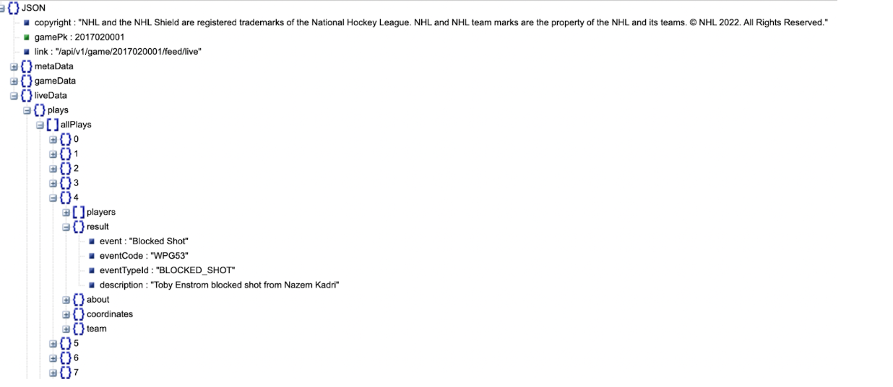 
<b> 2. Understanding Game ID </b> 
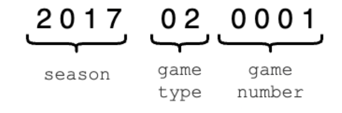 
The Game ID can be divided into 3 parts: 
<ol type="a">
  <li>Starting year of the season (eg. - ‘2017’ for the season ‘2017-2018’)
</li>
  <li>Type of game (‘01’ for pre-season, ‘02’ for regular, ‘03’ for playoffs, ‘04’ for all-star)</li>
  <li>Game number - The game number varies for ‘regular’ and ‘playoffs’ games as:</li>
</ol>

<table>
  <tr>
    <th>Game Type</th>
    <th>Values</th>
  </tr>
  <tr>
    <td>Regular</td>
    <td>1 to 1271</td>
  </tr>
  <tr>
    <td>Playoffs</td>
    <td>The 2nd digit of the specific number gives the round of playoffs, the 3rd digit specifies the matchup, and the 4th digit specifies the game(out of 7)
</td>
  </tr>
</table>

<b> 3. Downloading the data</b> 
The data can be downloaded using a single line of code using the `requests` package in Python as :
    response_API = requests.get('https://statsapi.web.nhl.com/api/v1/game/'+str(game_id)+'/feed/live/')

However, to download the data for all games from 2017-2020, keep relevant checks and modularize the code, we have divided the code into different functions:

<table>
  <tr>
    <th>Function</th>
    <th>Description</th>
  </tr>
  <tr>
    <td>fetch_data()</td>
    <td>Returns play-by-play data as raw JSON for a given year, game type and game number</td>
  </tr>
  <tr>
    <td>is_valid_game_id()</td>
    <td>Checks whether a given game ID is valid or not</td>
  </tr>
  <tr>
    <td>generate_filepath()</td>
    <td>Generates a filepath to store the JSON locally, given a year, game type and game ID</td>
  </tr>
  <tr>
    <td>fetch_raw_json()</td>
    <td>Fetches a JSON file if present locally, otherwise downloads the data based on the info in filepath</td>
  </tr>
  <tr>
    <td>download_via_api()</td>
    <td>Hits the NHL API to fetch the play data for a given game based on the given path</td>
  </tr>
  <tr>
    <td>download_all_json()</td>
    <td>Additional utility function that downloads all play data for a given year and game type</td>
  </tr>
  <tr>
    <td>get_game_ids()</td>
    <td>Returns a list of game IDs fetched from the NHL API for a given year and game type</td>
  </tr>
</table>


def fetch_data(self, year, game_type, game_number):
        '''
        To fetch the data given the year, game_type(regular or playoff), game_id
        returns: raw JSON
        '''

        game_id = year + '02' + game_number if game_type == 'R' else year + '03' + game_number
        if self.is_valid_game_id( year, game_type, game_id):
            filepath = self.generate_filepath('data', year, game_type, game_id)
            raw_data = self.fetch_raw_json(filepath)

            return raw_data


The `fetch_data()` function helps us to fetch the play-by-play data in JSON format for a given year, game type(regular or playoff) and game number.

It uses the following functions inside it: 
a. 

def is_valid_game_id(self, year, game_type, game_id):
        '''
        To check if a generated game ID is valid or not
        returns: True or False
        '''
        
        season = year + str(int(year)+1)
        return game_id in self.get_game_ids(game_type, season)

Checks whether a game ID is valid or not based on a list fetched from the NHL API. 
b. 

 def download_via_api(self, filepath):
        '''
        To download a specific game and saving the JSON in the given `filepath`.
        game_id is extracted from the `filepath`. Returns the extracted JSON.
        returns: dict 
        '''
        
        game_id = os.path.split(filepath)[-1][:-5]
        response_API = requests.get('https://statsapi.web.nhl.com/api/v1/game/'+str(game_id)+'/feed/live/')
        if response_API.status_code == 200:
            response = response_API.json()

            with open(filepath, "w") as outfile:
                json.dump(response, outfile, indent=4)  
            return response

Hits the API and downloads the data for a given file path(which contains info about season, game type and game ID) and returns the JSON. 
c.

def fetch_raw_json(self, filepath):
        '''
        To fetch the raw JSON as a dictionary given a `filepath`.
        returns: dict
        '''

        out = ''
        if not os.path.exists(filepath):
            out = self.download_via_api(filepath)
        else:
            with open(filepath, 'r') as file:
                data = file.read()
            out = json.loads(data)

        return out

Fetches the raw JSON from a locally saved JSON file. If missing, it downloads the data from NHL API using download_via_api()  
d.

def generate_filepath(self, parent_dir, year, game_type, game_id):
        '''
        To generate the filepath given the year, game_type(regular or playoff), game_id
        returns: str
        '''

        game_type = game_type.upper()
        tmp_path = os.path.join(parent_dir, year, game_type)
        if not os.path.exists(tmp_path):
            os.makedirs(tmp_path)
        return os.path.join(parent_dir, year, game_type, game_id) + '.json' 

Helps generate a filepath for locally saving the JSON file given the year, game type, game id. 
e. 

def get_game_ids(self,game_type:str,season:str):
        '''
        To get a list of game IDs from the NHL API
        returns: list
        '''

        sck=requests.get('https://statsapi.web.nhl.com/api/v1/schedule?season='+season)
        myjson = sck.json()
        data=myjson
        gid_r=[]
        dic={}
        for i in data['dates']:
            for j in i['games']:
                gid=0
                for x,y in j.items():
                    if x=='gamePk':
                        gid=y
                    if x=='gameType':
                        if y==game_type:
                            gid_r.append(str(gid))
                        break
        return gid_r

Returns a list of actual game IDs fetched from the NHL API for a particular season and game type. 
f. 

def download_all_json(self,year:str,game_type:str):
        '''
        To download all the game data from 2017 - 2020 for regular and playoff matches
        '''

        gyear = year +str(int(year)+1)
        game_id=self.get_game_ids(game_type,gyear)
        path=str(year)
        if not os.path.exists(os.path.join('data', year)):
            os.makedirs(os.path.join('data', year))
        # game_type = 'regular' if game_type=='R' else 'playoffs'

        for i in range(len(game_id)):
            filepath = self.generate_filepath('data', year, game_type, game_id[i])
            self.download_via_api(filepath)

Additional utility function to download data for all games in a given season and game type.
## Question 2.1 Interactive Debugging Tool Description

<b>Create simple interactive tools with ipywidgets</b>

ipyWidgets is a Python library for HTML interactive widgets for Jupyter notebooks, which can create real-time responsive widgets for real-time interaction.

There are two widget types used in Project: IntSlider and Dropdown. There are a total of four widgets in the interactive tools: w_gameType; w_year; w_game_id and w_events.and values of w_game_id and w_events will change with values of w_gameType; w_year. The data transfer between widgets is shown in the figure:

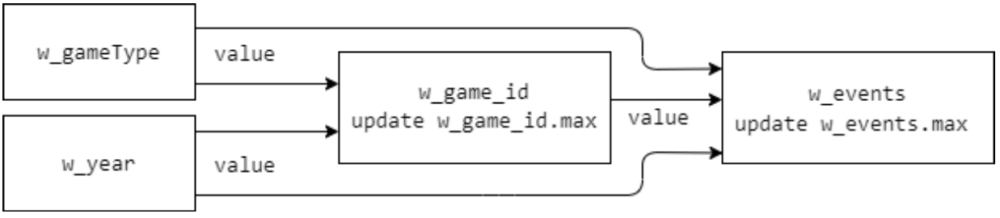 
Then obtain the information from the json file and draw the event coordinates on the provided ice rink image.

<b>Code:</b>


#dropdown widget
w_gameType = widgets.Dropdown(
    options=['regular', 'play-off'],
    description='game_type',
    disabled=False,
)
#dropdown widget
w_year = widgets.Dropdown(
    options=['2016', '2017', '2018', '2019', '2020'],
    description='year',
    disabled=False,
)
#IntSlider widget game_id, and value <game_id_max> will be influence by <gameType> and <year>
w_game_id = widgets.IntSlider(
    min= 1,
    max = 1271,
    description='game_number',
    disabled=False,
    style={'description_width': 'initial'}
)
#IntSlider widget events, and value <events_max> will be influence by <gameType>, <year> and <game_id>
w_events = widgets.IntSlider(
    min= 1,
    max = 100,
    description='events',
    disabled=False,
)
u1 = widgets.HBox([w_gameType, w_year])
u2 = widgets.HBox([w_game_id, w_events])
ui = widgets.VBox([u1, u2])
#display(w_gameType, w_year)
 
 
def f(w_year, w_gameType, w_game_id, w_events):
    '''
    Display data and puck position
    game_data -> .json
    get all information from game_data
    '''
    game_type = 'R' if w_gameType == 'regular' else 'P'
    game_ids_list = obj_extraction.get_game_ids(game_type, w_year + str(int(w_year)+1))
    game_data = obj_extraction.fetch_data(w_year, game_type, game_ids_list[w_game_id - 1][-4:])
 
    #team_name_abbreviation
    team_home = game_data["gameData"]["teams"]["home"]["abbreviation"]
    team_away = game_data["gameData"]["teams"]["away"]["abbreviation"]
    #goal
    team_home_goals = game_data['liveData']["linescore"]["teams"]["home"]["goals"]
    team_away_goals = game_data['liveData']["linescore"]["teams"]["away"]["goals"]
    #shotsOnGoal
    team_home_sog = game_data['liveData']["linescore"]["teams"]["home"]["shotsOnGoal"]
    team_away_sog = game_data['liveData']["linescore"]["teams"]["away"]["shotsOnGoal"]
    #SO Goals
    team_home_SO_goal=game_data['liveData']["linescore"]["shootoutInfo"]["home"]["scores"]
    team_away_SO_goal=game_data['liveData']["linescore"]["shootoutInfo"]["away"]["scores"]
    #SO Attempts
    team_home_SO_att=game_data['liveData']["linescore"]["shootoutInfo"]["home"]["attempts"]
    team_away_SO_att=game_data['liveData']["linescore"]["shootoutInfo"]["away"]["attempts"]
    #event_time
    event_time = game_data['liveData']['plays']['allPlays'][w_events - 1]["about"]["periodTime"]
    event = game_data['liveData']['plays']['allPlays'][w_events - 1]["result"]["description"]
    #period_info [1, 2, 3]
    period_time = game_data['liveData']['plays']['allPlays'][w_events - 1]["about"]["periodTime"]
    period = game_data['liveData']['plays']['allPlays'][w_events - 1]["about"]["period"]
 
    #str game_info##################################################################################
    print('game_id \t'+ game_ids_list[w_game_id-1])
    print('total games \t'+ str(len(game_ids_list)))
    print('total events \t' + str(len(game_data['liveData']['plays']['allPlays'])))
    print('dateTime \t'+game_data["gameData"]["datetime"]["dateTime"])
 
    #table game_info################################################################################
    data = {'Home': [
        team_home,
        team_home_goals,
        team_home_sog,
        team_home_SO_goal,
        team_home_SO_att
        ],
     'Away': [
        team_away,
        team_away_goals,
        team_away_sog,
        team_away_SO_goal,
        team_away_SO_att
        ]
    }
    df = pd.DataFrame(data, index= ['Teams:','Goals:','SoG:','SO Goals:','SO Attempts'])
    print(df)
 
    #plot_information##############################################################################
    fig = plt.figure(figsize=(8, 4))
    img = matplotlib.image.imread('./nhl_rink.png')
    fig, ax = plt.subplots()
    ax.imshow(img,extent=[-100, 100, -42.5, 42.5])
 
    plt.xlim((-100, 100))
    plt.ylim((-42.5, 42.5))
    my_y_ticks = np.arange(-42.5, 42.5, 21.25)
    plt.yticks(my_y_ticks)
    plt.xlabel('feet')
    plt.ylabel('feet')
 
   
    if period % 2 == 0:#switch sides when P = 2 4 6 8
        plt.title(event + '\n' + period_time + '  P-' + str(period) + '\n'+ team_home + ' '*40 + team_away)
    else:
        plt.title(event + '\n' + period_time + '  P-' + str(period) + '\n'+ team_away + ' '*40 + team_home)
 
    try:
        X = game_data['liveData']['plays']['allPlays'][w_events - 1]['coordinates']['x']
        Y = game_data['liveData']['plays']['allPlays'][w_events - 1]['coordinates']['y']
        #print(X, Y)
        plt.plot([X],[Y],'bo')
        plt.annotate(' <'+str(X)+', '+str(Y)+'>', xy=(X, Y))
 
    except:
        plt.text(-50, 0, "! no puck on the field at this time !")
        #print("There is no puck on the field at this time !")
   
    plt.show()
    #print play_info##############################################################################
    play_info = game_data['liveData']['plays']['allPlays'][w_events - 1]
    pprint.pprint(play_info)
 
 
   
 
#question: Is it possible to reuse variables in every func?
#update game_id_max
def update_w_game(*arg):
    game_type = 'R' if w_gameType.value == 'regular' else 'P'
    game_ids_list = obj_extraction.get_game_ids(game_type, w_year.value + str(int(w_year.value)+1))
 
    w_game_id.max = len(game_ids_list)
w_gameType.observe(update_w_game, names='value')
w_year.observe(update_w_game, names='value')
 
#update w_events_max
def update_w_events(*arg):
    game_type = 'R' if w_gameType.value == 'regular' else 'P'
    game_ids_list = obj_extraction.get_game_ids(game_type, w_year.value + str(int(w_year.value)+1))
   
    game_data = obj_extraction.fetch_data(w_year.value, game_type, game_ids_list[w_game_id.value - 1][-4:])
    id_number = len(game_data['liveData']['plays']['allPlays'])
    w_events.max = id_number
w_gameType.observe(update_w_events, names='value')
w_year.observe(update_w_events, names='value')
w_game_id.observe(update_w_events, names='value')
 
 
out = widgets.interactive_output(f,{'w_year': w_year, 'w_gameType': w_gameType, 'w_game_id' : w_game_id, 'w_events' : w_events})
display(ui, out)

 
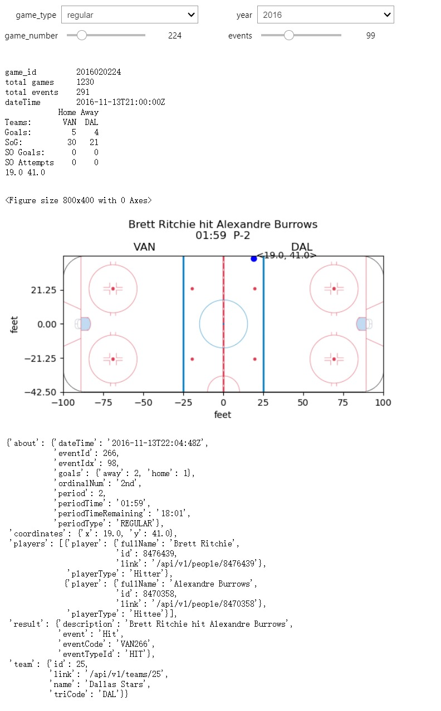 

## Question 4.1 Small snippet of dataframe

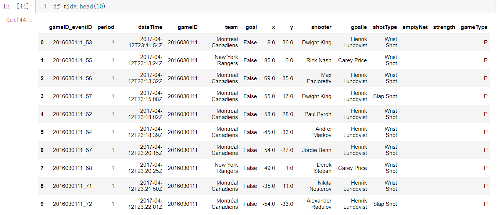 

## Question 4.2 Discussion of adding actual strength to both shots and goals

The most straightfoward way would be:

<ol>
<li>For each <i>event shot</i> or <i>goal</i>, initialize 2 counters, both set to 5.</li> 

<li>Read its <i>dateTime</i> feature and go backward in the <i>liveData</i> dictionary till an <i>event</i>
 with <i>dateTime</i> more than 5 minutes behind is met.</li>
 
<li>Check if there's any <i>event</i> of type <i>penalty</i> during this 5 minutes timeframe.</li>

<li>If there's a <i>minor penalty</i>, check if its <i>dateTime</i> is within 2 minutes of current event (<i>shot or goal</i>).
If yes, check the name of <i>team</i> on which the penalty was drew, make its counter -1.
If not, do nothing.
</li>

<li>If there's a <i>major penalty</i>, check the name of <i>team</i> on which the penalty was drew, make its counter -1.</li>

<li>Create the <i>strength</i> feature for each <i>shot or goal</i> by displaying the counters of both team (team shooting on team defensing).
</li>
</ol>
## Question 4.3 Discussion of creating more features from the dataset

<ol>
<li>
A feature <i>rebound</i> can be created, it's determined by whether a <i>shot or goal</i> was shoot within 5 seconds after the previous <i>shot</i>.
</li>
<li>
A feature <i>ownGoal</i> can be created, it's determined by whether the <i>scorer</i> was from the opponent team of scoring team.
</li>
<li>
A feature <i>solo</i> can be created, it's determined by whether there are no <i>players with type Assist</i> in a <i>goal</i> event. 
</li>
</ol>
## Question 5.1 Figure comparing the shot types over all teams

Produce a figure comparing the shot types over all teams for 2016(season 2016-2017)

Overlay the number of goals overtop the number of shots. In all shooting types, the most dangerous type of shot is deflected, although it is not a common shot type, It has the most goals chance 19.80%. The most common type of shot is wrist shot, it accounts for almost half of the shots. 
We chose to use a stacked bar plot, because it can clearly compare the number of discrete categories, in our case the shot type. Then, added the percentage of points scored as the label of bars, which can show the accuracy of shot types.

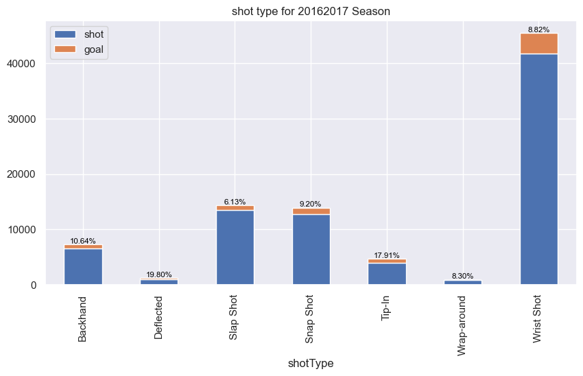 

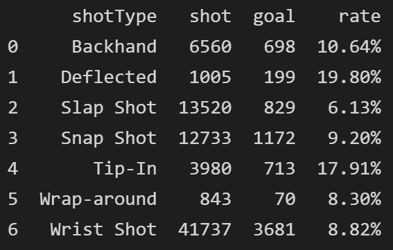 

## Question 5.2 Figure demonstrating relationship between the distance of shot and the chance of goal

Produce a figure for each season between 2018-19 to 2020-21 to show the relationship between the distance a shot was taken and the chance it was a goal.

Obviously, the closer you are to the goal, the easier it is to score. Because in case of close shots the reaction time left for the goalkeeper will be shorter than long shots. According to the data, the highest rate of scoring shots are from the area of 10-20 feet away from the net, this area provides the best chances at getting clean shots on goal. This trend almost hasn't changed in these three seasons, but in seasons 20202021 the rate of goals from long range has increased.

We choose to use LinePlot because it can clearly show the relationship between the x and y axes, in our case its distance and goal rate. Then,  we also draw another LinePlot to show the number of shots and distance.

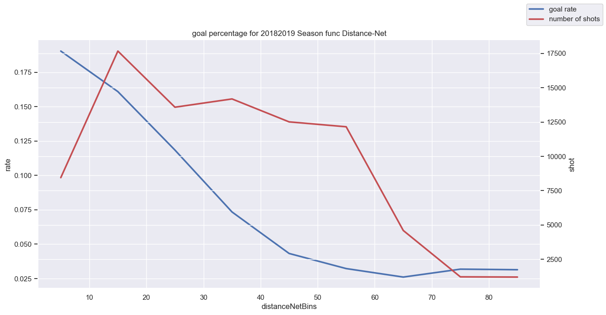 
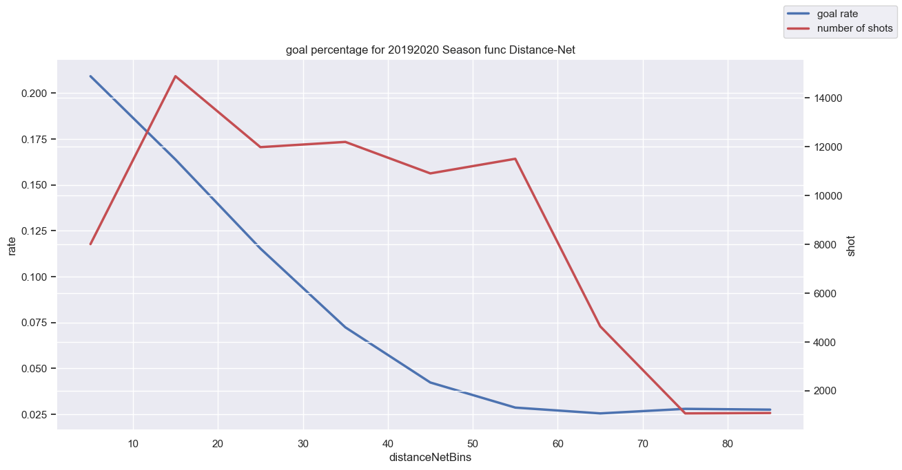 
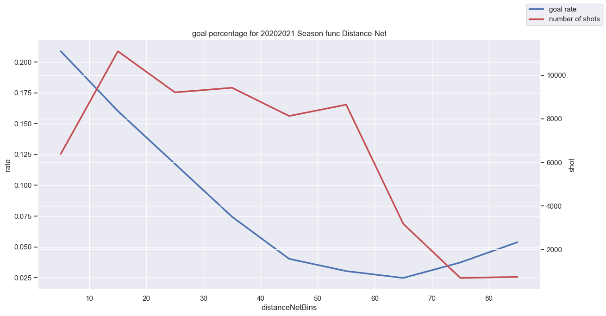 
## Question 5.3 Figure showing goal percentage as function of both distance from the net and the category of shot types

Produce a figure that shows the goal percentage (# goals / # shots) as a function of both distance from the net, and the category of shot types in season 20202021.

To reduce noise, we only counted the types of shots with more than 50 times from each short distance.

At almost all distance, the Slap Shot is the most effective shot type, it have a best chance of scoring from the net to long range.(5-65 feet)

At long distance, the Wrist Shot has a greater chance of scoring.(65-85 feet)

The closer to the net, the Deflected is more effective.(5-15 feet)

Snap Shot is also effective in short to medium distance.(5-35 feet))

Overall, the most dangerous type of shooting is Slap Shot.

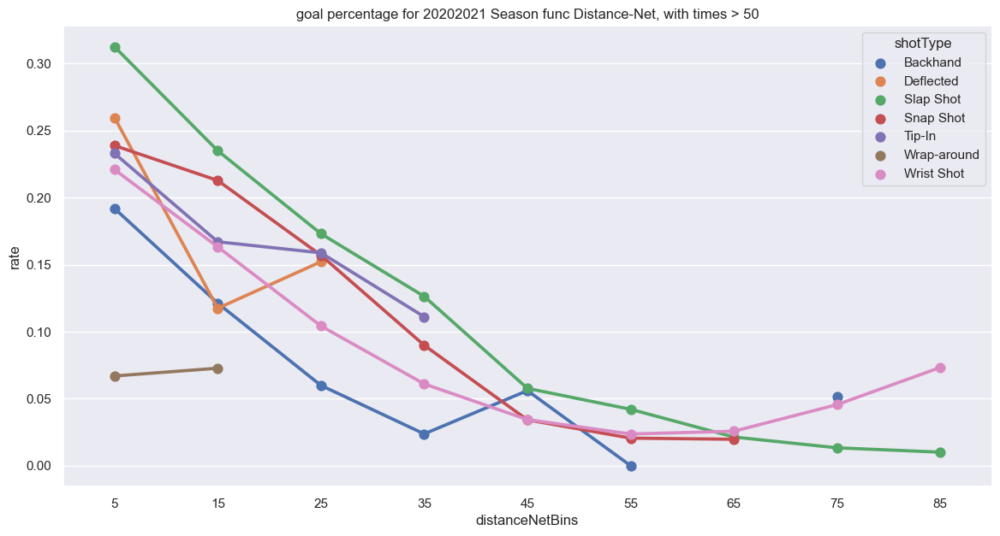 

We also produce a figure that shows the number of shot types. Wrist Shot is indeed the most common way to shoot and goal. although the Snapshot has a high score rate. And, SnapShot is usually used at a mid-range.(about 55 feet)

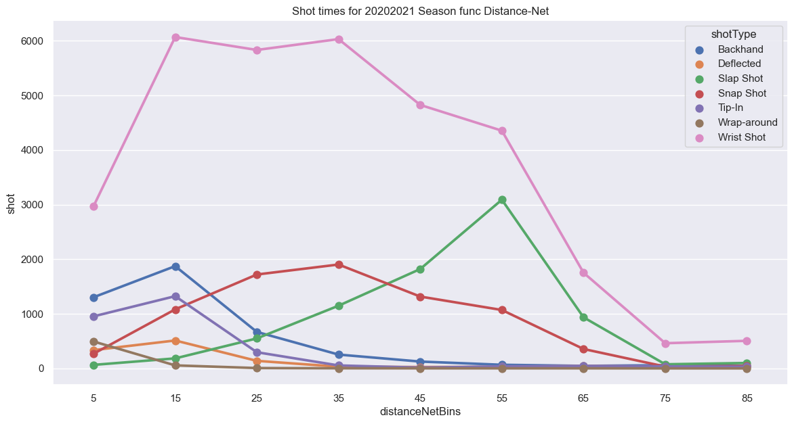 
<b>Notes on the team side:</b> 
We noticed that it seemed impossible to know exactly which side the team was on the rink.

At first we tried to use the initial side of the team home in the first period to calculate the side for the rest period. Then calculate the distance from coordinate shot to net.


#get distanceNet

df_tidy['homeTeamSide'] = np.where(df_tidy['period'] % 2 == 0, 'left', 'right')#P1 = right, P2 = left

df_tidy['awayTeamSide'] = np.where(df_tidy['period'] % 2 == 0, 'right', 'left')#p1 = left, P2 =right

df_tidy['AttTeamSide'] = np.where(df_tidy['team'] == df_tidy['home'], df_tidy['homeTeamSide'], df_tidy['awayTeamSide'])

#https://community.rapidminer.com/discussion/44904/using-the-nhl-api-to-analyze-pro-ice-hockey-data-part-1

leftNetCoX = -89

rightNetCoX = 89

df_tidy['distanceNet'] = np.where(

    df_tidy['AttTeamSide'] == 'right',

    ((df_tidy['x'] - leftNetCoX)**2 + (df_tidy['y'] - 0)**2)**0.5,

    ((df_tidy['x'] - rightNetCoX)**2 + (df_tidy['y'] - 0)**2)**0.5

    )
 

But then we found that the distribution of distances is very strange, in fact the vast majority of shots are taken in the half rink close to the net.

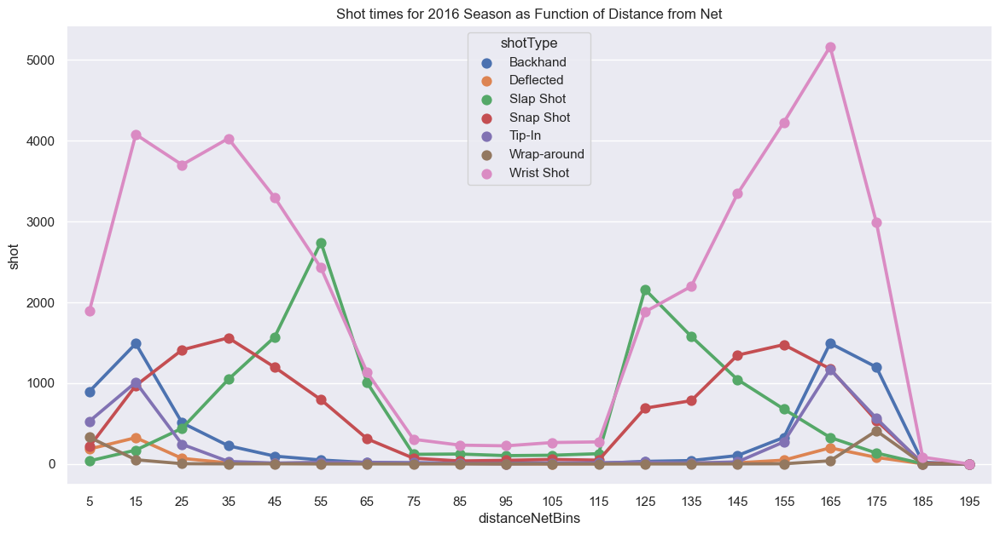 
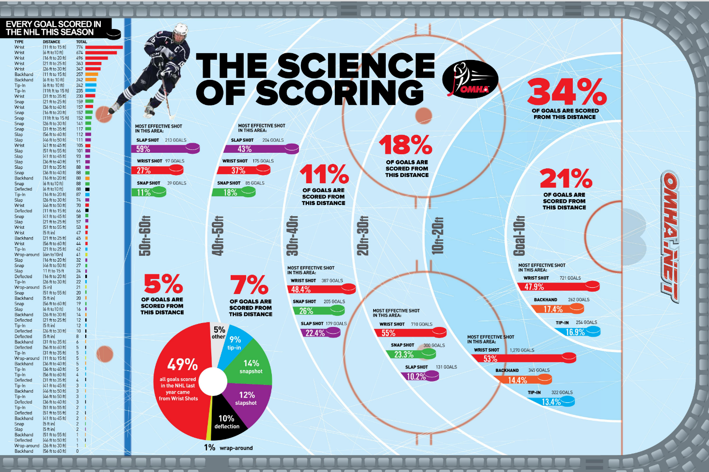 

Source: https://www.omha.net/news_article/show/667329-the-science-of-scoring 

According to NHl statistics, 96% of shots happen at the half rink near the goal. So we change the logic to calculate the distance. We assume that all shots are aimed at the nearest goal, this may cause a little error in our data, but it does not change the general trend.


"""< Det_Distance_Net. >

Determine the distance to the net based on the puck's coordinates, we assume always shoot the nearest net.

certain errors may occur, In reality about 96% are in the half near the net.

:df_tidy['x']:                      column of dataframe - coordinates X

:df_tidy['y']:                      column of dataframe - coordinates Y

:leftNetCoX = -89:                  fixed value - Net coordinates X

:rightNetCoX = 89:                  fixed value - Net coordinates Y

:return: df_tidy['distanceNet']:    new column of dataframe

"""

#https://community.rapidminer.com/discussion/44904/using-the-nhl-api-to-analyze-pro-ice-hockey-data-part-1

leftNetCoX = -89

rightNetCoX = 89

#Always shoot at the nearest goal

df_tidy['distanceNet'] = np.minimum(

    ((df_tidy['x'] - leftNetCoX)**2 + (df_tidy['y'] - 0)**2)**0.5,

    ((df_tidy['x'] - rightNetCoX)**2 + (df_tidy['y'] - 0)**2)**0.5

    )
 

## Question 6.1 Embed 4 offensive zone plots
<b>Shot Maps for Season 2016-2017</b> 



<b>Shot Maps for Season 2017-2018</b> 



<b>Shot Maps for Season 2018-2019</b> 



<b>Shot Maps for Season 2019-2020</b> 



<b>Shot Maps for Season 2020-2021</b> 



## Question 6.2 Discussion on offensive zone plots

<ol>
<li>
Almost every team tends to shoot near the net (in range -10 to +10 for x,y positions from the net)
</li>
<li>
Teams like San Jose Sharks have maintained their offensive style across multiple seasons: most shots near net or around 50 ft away from net on the left side of rink
</li>
<li>
Teams like Washington Capitals have changed their offensive style across multiple seasons: from shots mostly in the middle position of x-axis to a rather dispersed shooting area in season 2020-2021
</li>
</ol>

## Question 6.3 Discussion about the team Colorado Avalance based on comparison of their shot map during 2016-17 and 2020-21

In season 2016-2017, team Colorado Avalance has a rather low shot rate in front of net (10 to 20 ft away from net) compared to league average shot rate at the same position.

However, in season 2020-2021, team Colorado Avalance has a definitively higher than average shot rate near net, which indicates a change of playstyle. 
## Question 6.4 Discussion about the comparison between the team Buffalo Sabres and the team Tampa Bay Lightning, based on their shot maps

They both shoot around near to mid range (10 - 50 ft away from net).
Buffalo Sabres tends to shoot more on both left and right side position, but less in the middle position.
Tampa Bay, quite the opposite, tends to shoot mostly in the middle position, but less on sides.
  
  

## Question 2 Feature Engineering I

### 2.1

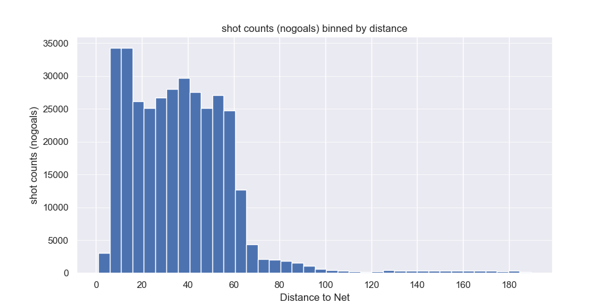
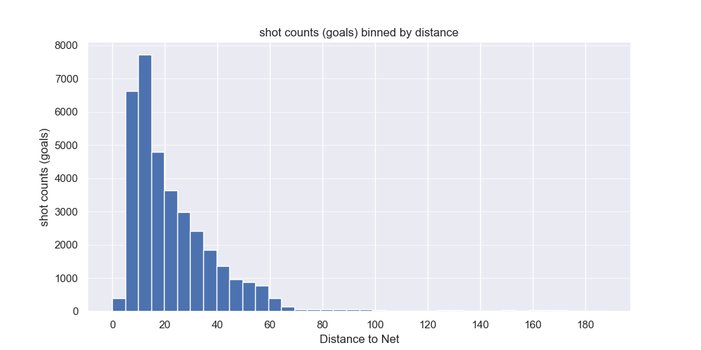

<i>Histograms of shot counts for distance to the net(goals and no-goals)</i>
 

We have displayed two histograms of the shot count with goals and no goals from the dataset( 2015/16 - 2018/19 regular season data) which present their distance to the net. 
We can see that when the distance exceeds 60ft, the number of shots on the goal drops rapidly, and the further away, the less the number of counts to score. In addition, it is very rare to shoot at the opponent's goal in the own half-rink, let alone get a goal. 
This might be because the longer the distance of the shot, the smaller the goal for the Shooter and the longer the reaction time for the Goaltender. 

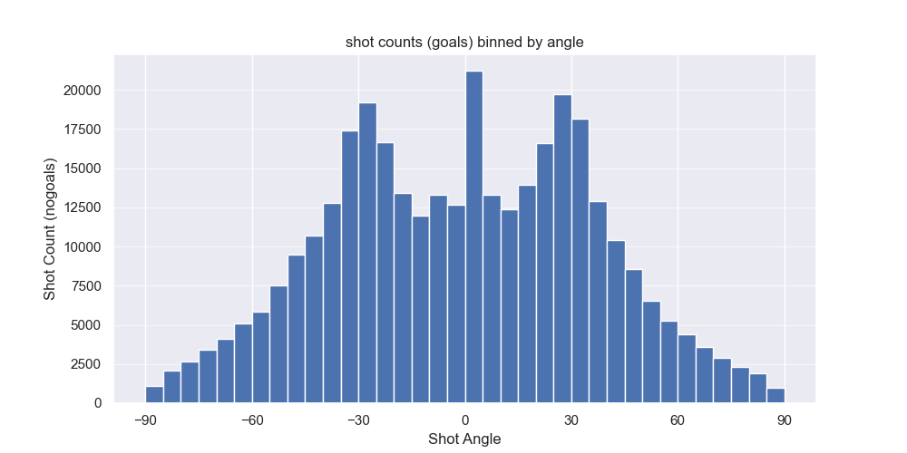
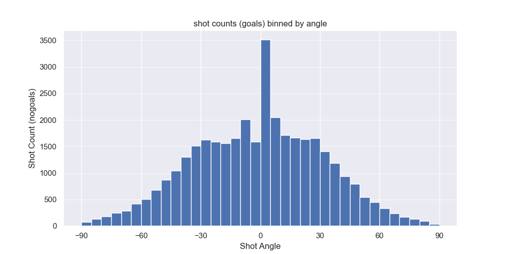

<i>Histograms of shots for angle to the net (goals and no-goals)</i>
 

We have displayed two histograms of the shot count with goals and no goals from the dataset( 2015/16 - 2018/19 regular season data) which present their angle to the net. 
Interestingly, we can see that the shooters often seem to be shooting straight to the net or shooting at an angle of around +/-30 degrees. However, for goals taken the most often scored is shooting straight to the net. And after the angle is greater than +/-30 degrees, the number of scoring starts to decrease. 

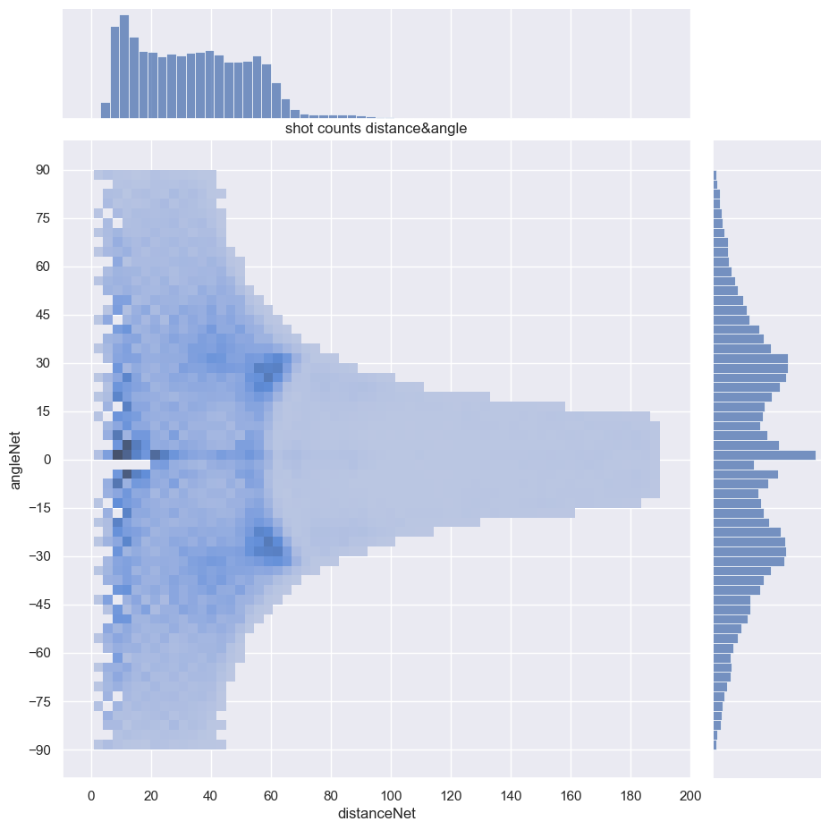

<i> 2D scatter plot and histograms of shot counts for distance and angle</i>
 

From the 2D histogram, we can see the closer to the goal, the more likely the shooter is to attempt a wide-angle shot. When farther from the net, the shooter tends to shoot from a little angle.  
We also noticed that the areas with the most frequent shooting attempts were: the area near the goal, areas around 60 feet away from the net, and +/-30 degrees.

### 2.2
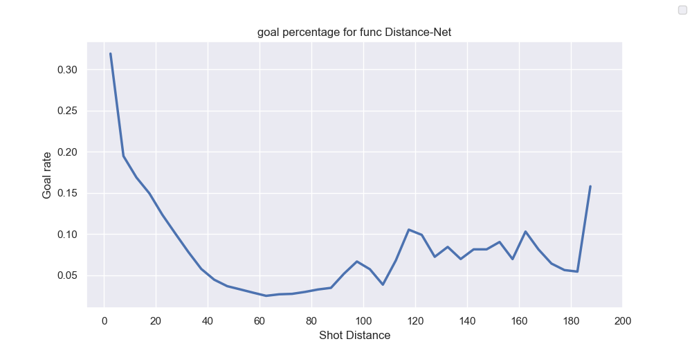
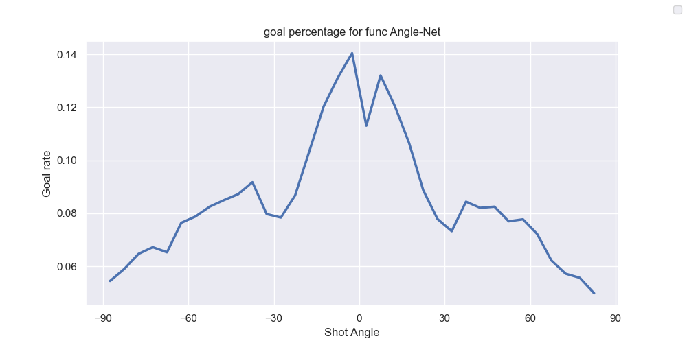

<i>goal rate for shot distance and goal rate for shot angle</i>
 

We have displayed two Line charts of the goals rate which present their distance and angle to the net. 
We can draw similar conclusions as before from the two plots: The closer shooters get to the net and the smaller the angle, the more likely to score a goal. 
It can be noticed that the goals rate fluctuates and increases when far away from the net. This is probably due to the players being more willing to shoot from long distances only when the net is empty, so the goal rate increases at this time.

### 2.3

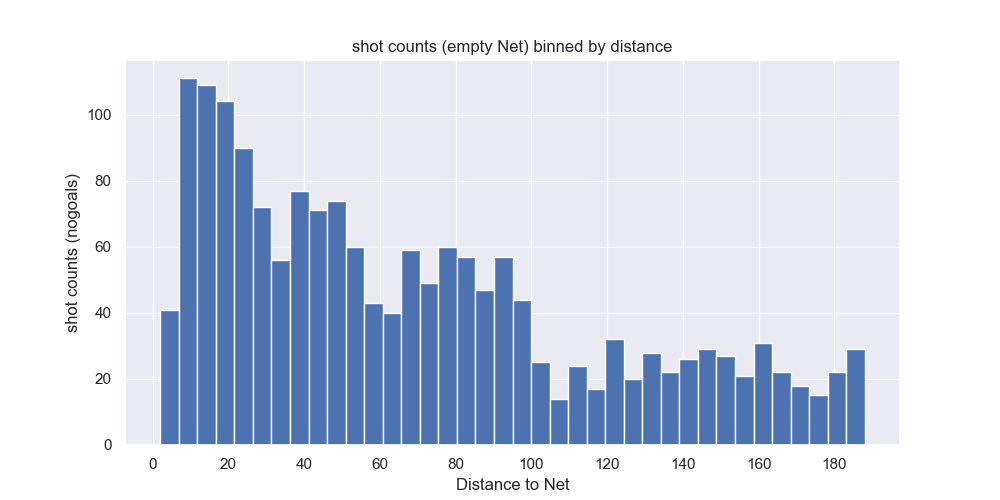

The two histograms show the proportion of empty and non-empty nets scores. The obvious difference that can be observed is the distance between empty net goals and non-empty net goals. Most goals scored on a non-empty ball are relatively close to the net. However, when the net is empty, shooters have more chances to get scores when shot from almost anywhere on the court. 
After using our “domain knowledge” for some quick sanity checks, We found a very suspicious goal:

| Name Info         | Info              |
| -----------       | -----------       |
| gameID:           | 2016020510        |
| eventID :         | 297               |
| period :          | 2                 |
| home:             | Florida Panthers  |
| away:             | Detroit Red Wings |
| shooter:          | Derek MacKenzie   |
| Shot coordinates: | -97, 21           |
| distanceNet:      | 187.2             |
| angleNet:         | 6.4               |

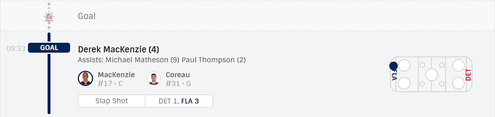

We noticed that this shot was very far from the Net. 
According to the 2 minutes 37 seconds of the game video on youtube, we can confirm that this is the wrong coordinate data. It wasn't a long shot, it was a One timer shot after a pass. 
The goal can be seen [here](https://www.youtube.com/watch?v=We-JH8xWf1M&t=192s) at the 2:35 timestamp

## Question 3 Baseline Models

### 3.1

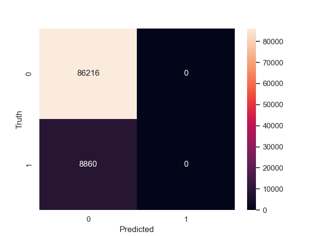

<i>Heatmap of predictions on the validation set from the logistic regression  distance feature</i>
 

We evaluate the accuracy on the validation set using a heatmap, which shows that the model predicts that all shots are missed. However, the accuracy of the model is over 90%, because in the validation set, the number of shots on goal is much smaller than the number of missed shots. (1:10) At this point, the accuracy of the results is not a good indicator, we should consider recall and precision.  

### 3.2 and 3.3

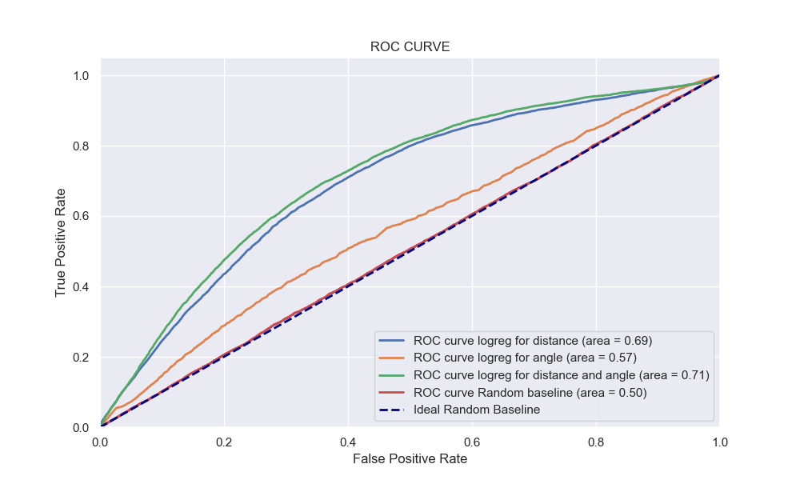

<i>ROCcurves of the logistic regression model from different features and random baseline</i>
 

ROC curves typically feature true positive rate on the Y axis, and false positive rate on the X axis. This means that the top left corner of the plot is the “ideal” point - a false positive rate of zero, and a true positive rate of one. This is not very realistic, but it does mean that a larger area under the curve (AUC) is usually better. 
We have displayed ROC curves for four different models: logistic regression for distance, logistic regression for angle, logistic regression for distance and angle, Random baseline. In our case, the discriminative performance of the feature of distance is greater than that of the angle feature, and the best results can be obtained by using both features. 

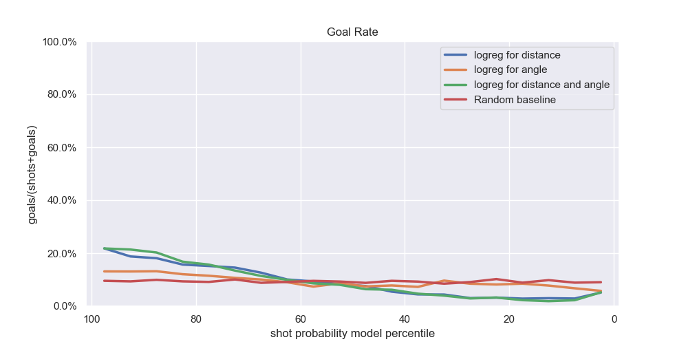

<i>Goal rate curves of the logistic regression model from different features and random baseline</i>
 

The goal rate plot shows a trend: in each bin, when the model predicts a higher probability of a goal, the higher the probability of a goal being scored in reality too. We can obtain similar results as before from the plot: the discriminative performance of the feature of distance is greater than that of the angle feature, and the best results can be obtained by using both features. 

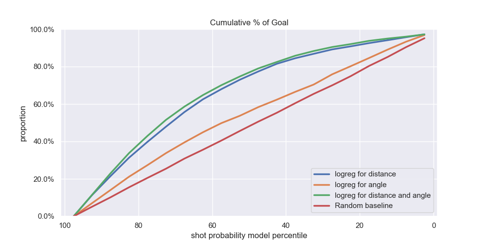

<i>Cumulative proportion of goals curves of the logistic regression model from different features and random baseline</i>
 

We can still observe similar results, the discriminative performance of angular features is lower than that of distance features, and the combination of the two achieves the highest discrimination.
 

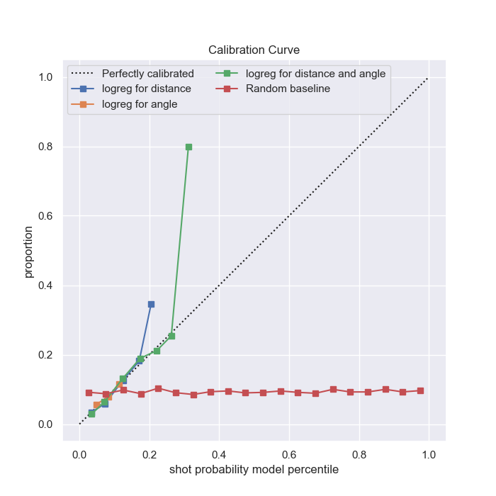

<i>Calibration curves of the logistic regression model from different features and random baseline</i>
 

Calibration curves (also known as reliability diagrams) compare how well the probabilistic predictions of a binary classifier are calibrated. It plots the true frequency of the positive label against its predicted probability, for binned predictions. 
From the obtained Calibration curves, we can see that all the models do not have high reliability due to the unbalanced amount of data. When the angle feature is used alone, its reliability is low, but relatively high reliability can be obtained when the angle and distance features are used together. Similarly, we can also confirm the correlation between the distance feature and the score. 

In general, it can be determined that the distance feature itself is very important to the performance of the model. When it is combined with angular features, the model performs slightly better. However, the angle feature itself is not very discriminative and follows the trend of random baselines. 

### 3.4

Links to the three experiment entries in the comet.ml projects that produced these three models.

[logreg for distance](https://www.comet.com/ift6758-22-team2/nhl-analytics/666e5521020146f2b85f9ca2f4d087fb) for the model with distance,

[logreg for angle](https://www.comet.com/ift6758-22-team2/nhl-analytics/4710a54204864cc8bed006e130c8872b) for the model with angle,

[logreg for distance and angle](https://www.comet.com/ift6758-22-team2/nhl-analytics 3c10fb4d2e74414b842f4620500115bd) for the model with both distance and angle.

## Question 4.5 Feature Engineering

<b> List of Added Features</b> 

<ol>
  <li> <b>game_seconds :</b> time passed in seconds since start of game.
  </li>
  <li> <b>game_period :</b> current period of game.
  </li>
  <li> <b>x :</b> x coordinate of the shot.
  </li>
  <li> <b>y :</b> y coordinate of the shot.
  </li>
  <li> <b>distanceNet_or_shotDistance :</b> distance between the net and the xy coordinates of the shot.
  </li>
  <li> <b>angleNet_or_shotAngleWithSign :</b> angle between the middle line (on y-axis) and the line connecting xy coordinates of the shot and net.
  </li>
  <li> <b>shot_angle_absolute :</b> absolute value of shot angle.
  </li>
  <li> <b>shotType :</b> type of shot.
  </li>
  <li> <b>last_event :</b> type of last event.
  </li>
  <li> <b>last_x :</b> x coordinate of last event.
  </li>
  <li> <b>last_y :</b> y coordinate of last event.
  </li>
  <li> <b>time_from_last_event :</b> time passed in seconds since the last event.
  </li>
  <li> <b>distance_from_last_event :</b> distance between xy coordinates of last event and current event.
  </li>
  <li> <b>rebound :</b> indicates whether this shot is a rebound shot. True if the last event was also a shot, otherwise False.
  </li>
  <li> <b>change_in_shot_angle :</b> The angle between the line passing through last shot position and net, and the line passing through current rebound shot position and net.
  </li>
  <li> <b>speed :</b>  the distance from the previous event divided by the time since the previous event.
  </li>
  <li> <b>time_since_powerplay_started :</b>  time passed (in seconds) since the start of power-play, reset to 0 when power-play ends.
  </li>
  <li> <b>nbFriendly_non_goalie_skaters :</b>  number of friendly skaters of the shooting team on the ice
  </li>
  <li> <b>nbOpposing_non_goalie_skaters :</b>  number of opposing skaters of the shooting team on the ice
  </li>
  <li> <b>team_side :</b>  the side of rink of the shooting team
  </li>
  
</ol>

<b>Comet.ml link storing to the experiment which stores the filtered DataFrame artifact for game 'wpg_v_wsh_2017021065':</b> 

<a href="https://www.comet.com/ift6758-22-team2/nhl-analytics/acf3478af3d1474eb6fdbab970370d9c"> https://www.comet.com/ift6758-22-team2/nhl-analytics/acf3478af3d1474eb6fdbab970370d9c </a>

## Question 5. Advanced Models
### 5.1 XGBoost using only `distance` and `angle` features
#### Experiment on comet.ml: <a href="https://www.comet.com/ift6758-22-team2/nhl-analytics/9d331e535f2249598410afcac3517d08?experiment-tab=chart" target="_blank">XGBoost with Distance and angle</a> 

<b>a. Preprocessing and Train/val split - </b>We take the game data from the 2015/16 to 2018/19 regular season. Before splitting the data, we do some preprocessing. Firstly, we correct the datatypes of `'x', 'y', 'last_x', 'last_y', 'distance_from_last_event', 'speed', 'sum_x', 'distanceNet'` to float type to maintain the consistency. We also replace NAN or missing values by the feature-mean for numerical features and apply “most frequent” strategy for non-numerical features. Finally, we apply one-hot encoding to categorical features like `'shotType', 'last_event'` etc.  We then divide the entire data into train-val splits in 75% and 25% ratios respectively.

<b>b. Performance - </b>Compared to the Logistic Regression model, the ROC AUC score improves slightly from `0.71` to `0.72` which we believe is because of the inherent capacity of the model. However, it is not a good performance for real-life use.  We therefore proceed to choose better features.

Here are some plots to demonstrate the performance of the model:

### 5.2 XGBoost using all features + cross-validation
#### Experiment on comet.ml: <a href="https://www.comet.com/ift6758-22-team2/nhl-analytics/4dbbaa9347834df9872defc89fb3e7cc?experiment-tab=chart" target="_blank">XGBoost with all features</a>  

We first manually test with 2 hyperparameters namely `eta` or `learning_rate` and `booster`. The results of the manual tuning is shown below:

Subsequently, we use the Grid Search technique for hyperparameter tuning. We use the following hyperparameters for tuning: 
- `eta` or `learning_rate`
- booster
- subsample
- max_depth
We use the `roc_auc` scoring criteria for the grid search. The best performance obtained for:

| Hyperparam        | Value             |
| -----------       | -----------       |
| eta               | 0.1               |
| booster           | "gbtree"          |
| max_depth         | 7                 |
| subsample         | 0.8               |

We find that the performance improves greatly compared to the XGBoost baseline model(trained with only distance and angle). There is around 3% increase in accuracy and the ROC AUC score has jumped from 0.50 to 0.63 showing an improvement. However, the most noticeable improvement is in the f-score metric which has improved from 0.006 to 0.42 which suggests the robustness of the model. Below are the performance measure of the best model using cross-validation:

### 5.3 XGBoost with feature selection + cross-validation
#### Experiment on comet.ml: <a href="https://www.comet.com/ift6758-22-team2/nhl-analytics/5a0f6b7429074bd6adf056f184519c30?experiment-tab=chart" target="_blank">XGBoost with feature selection</a>  

We use SHAP to interpret the dependency of the model on different features. Here’s a representation of the same:

Following this, we also explore 3 different feature selection strategies:
- Variance Threshold
- f_classif
- L1-based feature selection

Here’s the ROC curve after feature selection using the above algorithms:

We find the L1-based feature selection yields the highest ROC AUC score. We find that a similar performance is obtained using only 16 features instead of all features. The selected features are:
`'change_in_shot_angle' 'distanceNet_or_shotDistance' 'distance_from_last_event' 'game_period' 'game_seconds' 'last_event'  'last_x' 'nbFriendly_non_goalie_skaters' 'nbOpposing_non_goalie_skaters' 'rebound' 'shotType' 'shot_angle_absolute' 'speed' 'time_from_last_event' 'time_since_powerplay_started' 'y'`

Here’s the confusion matrix of the best XGBoost model:

Below we represent the comparisons of the various variants of the XGBoost models we have experimented with:

<b>[NOTE: The curve for "all features" and "feature selection" may be overlapping in the following graphs. This, although indicates similar performance between the two approaches, the "feature selection" approach uses lesser features.]</b>

## Question 6. Give it your best shot!
 
<b>6 a). discuss the various techniques and methods you tried. Include the same four figures as in Part 3 (ROC/AUC curve, goal rate vs probability percentile, cumulative proportion of goals vs probability percentile, and the reliability curve).</b>

<b>Training Data</b> - Data from year 2015/16 - 2018/19.  
<b>Experiment No. 1</b> 
Experiment Entry : <a href="https://www.comet.com/ift6758-22-team2/nhl-analytics/7903f1d820df4c249c73b0f90a9b5118?experiment-tab=chart&showOutliers=true&smoothing=0&transformY=smoothing&xAxis=wall">Q6_Best_Shot_MLP_Classifier</a>  
<b>Data pre-processing</b>

<ol>
  <li> <b>Categorical transform :</b> 
 <ul>
 <li>Simple imputer: used to remove categorical missing data related to one or more features with appropriate values. Strategy used = most_frequent, which replaces missing using the most frequent value along each column. 
 </li>
 <li>Encoding: Converting categorical information into ordinal numbers (0, 1, 2, 3, etc). So that model can interpret data more easily.
 </li>
 </ul>
  </li>
  <li> <b>Numerical transform :</b> 
  <ul>
 <li>Simple imputer: used to remove Numerical missing data related to one or more features with appropriate values. Strategy used = mean, which replace missing values using the mean along each column
 </li>
 <li>Standard Scaling: It removes the mean and scales each feature/variable to unit variance.
 </li>
 </ul>
  </li>
</ol>
<b>Feature Selection</b>  
Using SelectFromModel Meta-transformer for selecting features based on importance weights with Linear Support Vector Machine as the estimator for feature selection.
  
<b>Classifier</b>  
Model – MLP classifier (Multi-layer Perceptron classifier)
The multilayer perceptron (MLP) is a feedforward artificial neural network model that maps input data sets to a set of appropriate outputs. An MLP consists of multiple layers and each layer is fully connected to the following one. 
 

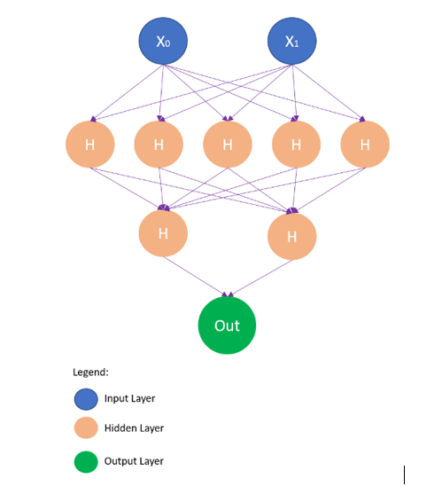

 
<b>Model Pipeline</b> 

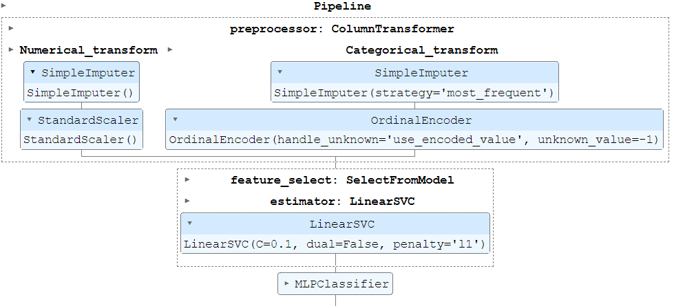

 
<b>Cross-validation technique</b>  
Cross-validation is a resampling method that uses different portions of the data to test and train a model on different iterations
StratifiedKFold Method: This cross-validation object is a variation of KFold that returns stratified folds. The folds are made by preserving the percentage of samples for each class.
 

<b>Hyperparameter tunning Method</b>  
RandomizedSearchCV: The RandomizedSearchCV class allows for stochastic search. stochastic search will sample hyperparameter 1 independently from hyperparameter 2 and find the optimal region for best fit.
Testing model for following hyperparameters:
 

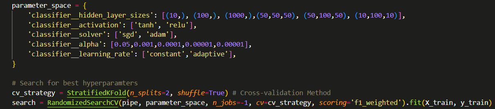

 
<b>best estimator:</b>

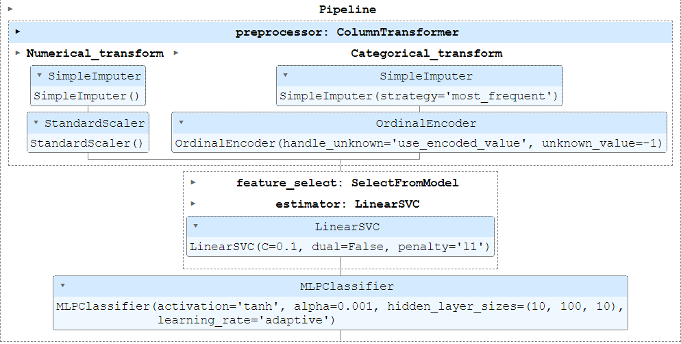

 
<b>Quantity Metric</b>

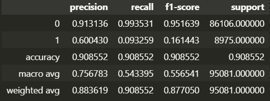

<b>Experiment No. 2</b>  
Experiment Entry : <a href="https://www.comet.com/ift6758-22-team2/nhl-analytics/5b1d30373735438ebbbf58c52427e9d7?experiment-tab=chart&showOutliers=true&smoothing=0&transformY=smoothing&xAxis=wall">Q6_Best_Shot_Random_forest</a> 
<b>Data pre-processing</b>
<ol>
  <li> <b>Categorical transform :</b> 
 <ul>
 <li>Simple imputer: used to remove categorical missing data related to one or more features with appropriate values. Strategy used = most_frequent, which replaces missing using the most frequent value along each column. 
 </li>
 <li>Encoding: Converting categorical information into ordinal numbers (0, 1, 2, 3, etc). So that model can interpret data more easily.
 </li>
 </ul>
  </li>
  <li> <b>Numerical transform :</b> 
  <ul>
 <li>Simple imputer: used to remove Numerical missing data related to one or more features with appropriate values. Strategy used = mean, which replace missing values using the mean along each column
 </li>
 <li>Standard Scaling: It removes the mean and scales each feature/variable to unit variance.
 </li>
 </ul>
  </li>
</ol>
<b>Feature Selection</b>  
Using RFECV(Recursive Feature Elimination, Cross-Validated) method for selecting features with Linear Regression model as estimator
  
<b>Classifier</b>  
Model – RandomForestClassifier
A random forest is a meta estimator that fits a number of decision tree classifiers on various sub-samples of the dataset and uses averaging to improve the predictive accuracy and control over-fitting 
 

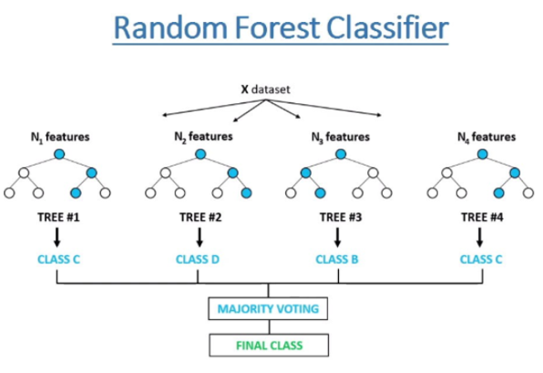

 
<b>Model Pipeline</b> 

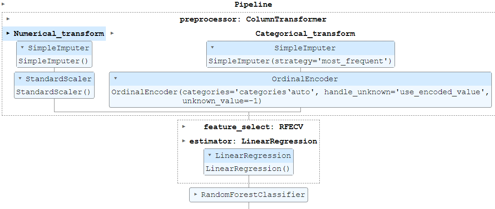

 
<b>Cross-validation technique</b>  
KFold Method: Provides train/test indices to split data in train/test sets. Split dataset into k consecutive folds. Each fold is then used once as a validation while the k - 1 remaining folds form the training set.
 

<b>Hyperparameter tunning Method</b>  
RandomizedSearchCV: The RandomizedSearchCV class allows for stochastic search. stochastic search will sample hyperparameter 1 independently from hyperparameter 2 and find the optimal region for best fit.
Testing model for following hyperparameters:
 

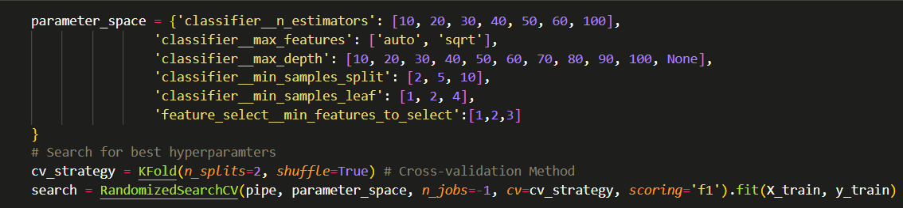

 
<b>best estimator:</b>

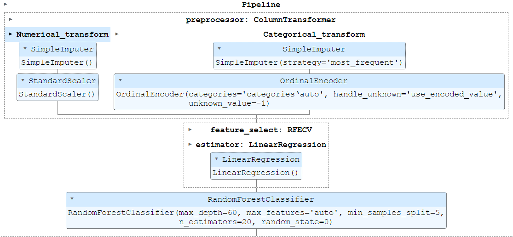

 
<b>Quantity Metric</b>

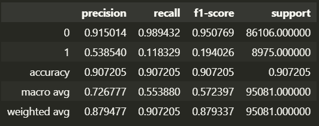

<b>Experiment No. 3</b>  
Experiment Entry : <a href="https://www.comet.com/ift6758-22-team2/nhl-analytics/924942559dc14af995c8755259a7afd4?experiment-tab=chart&showOutliers=true&smoothing=0&transformY=smoothing&xAxis=wall">Q6_Best_Shot_Knn</a> 
<b>Data pre-processing</b>

<ol>
  <li> <b>Categorical transform :</b> 
 <ul>
 <li>Simple imputer: used to remove categorical missing data related to one or more features with appropriate values. Strategy used = most_frequent, which replaces missing using the most frequent value along each column. 
 </li>
 <li>Encoding: Using One hot encoding method which encodes categorical features as a one-hot numeric array.
 </li>
 </ul>
  </li>
  <li> <b>Numerical transform :</b> 
  <ul>
 <li>Simple imputer: used to remove Numerical missing data related to one or more features with appropriate values. Strategy used = mean, which replace missing values using the mean along each column
 </li>
 <li>Standard Scaling: It removes the mean and scales each feature/variable to unit variance.
 </li>
 </ul>
  </li>
</ol>
<b>Feature Selection</b>  
Using RFE(Recursive feature elimination) method for selecting features with Decision tree classifier as estimator.
  
<b>Classifier</b>  
Model – k-nearest neighbors
The k-nearest neighbors algorithm, also known as KNN or k-NN, is a non-parametric, supervised learning classifier, which uses proximity to make classifications or predictions about the grouping of an individual data point.
 

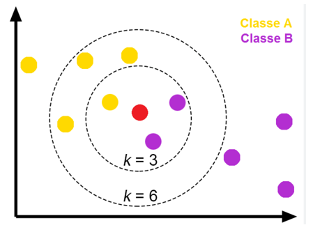

 
<b>Model Pipeline</b> 

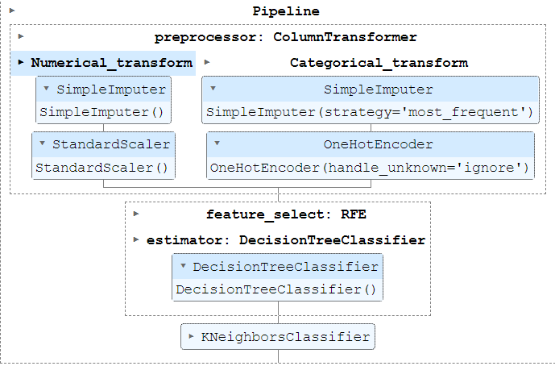

 
<b>Cross-validation technique</b>  
RepeatedKFold Method: Repeated K-Fold cross validator.Repeats K-Fold n times with different randomization in each repetition
 

<b>Hyperparameter tunning Method</b>  
GridSearchCV: GridSearchCV is a technique for finding the optimal parameter values from a given set of parameters in a grid
Testing model for following hyperparameters:
 

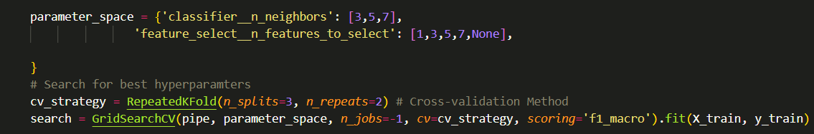

 
<b>best estimator:</b>

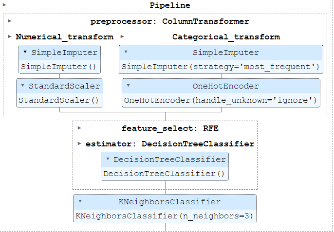

 
<b>Quantity Metric</b>

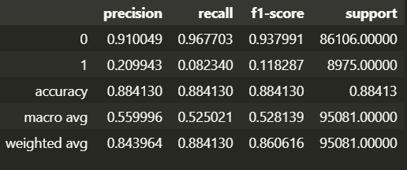

 
<b>Comparing all Experiments to find best ‘final’ model</b>  
Experiment Entry : <a href="https://www.comet.com/ift6758-22-team2/nhl-analytics/ca369bf926c34d959337975ef7fd027e?experiment-tab=chart&showOutliers=true&smoothing=0&transformY=smoothing&xAxis=step"> Q6_bestshot_ModelCompare </a>

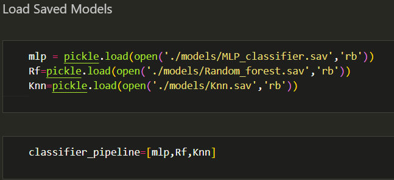

<b>Fitting model on train dataset to find best accuracy model</b>

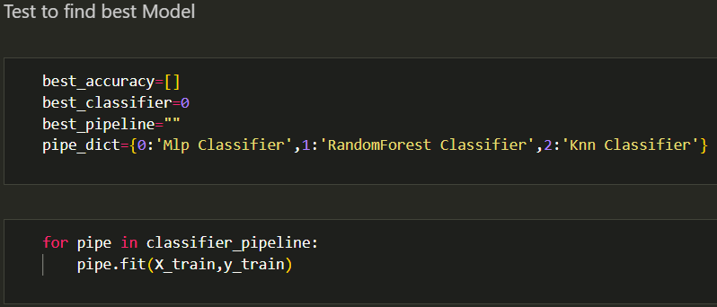

 

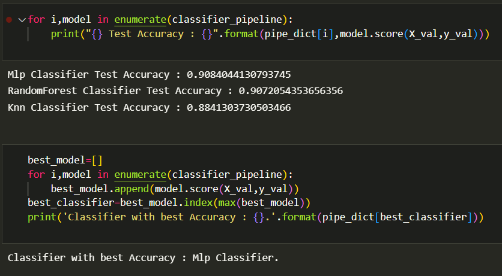

 
MLP Classifier gives the best accuracy on validation set  
<b>Combined Model performance Visualization</b>
  
Precision-Recall Curve

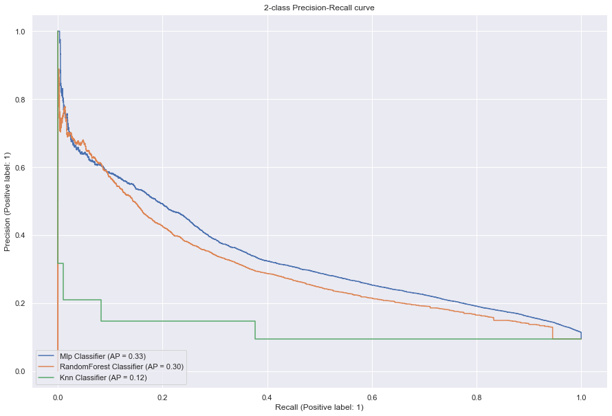
Entry :<a href="https://www.comet.com/api/image/download?imageId=8de0c56c46e543f580ce89adfcd80417&experimentKey=ca369bf926c34d959337975ef7fd027e">Precision-Recall Curve</a>

 

ROC Curve

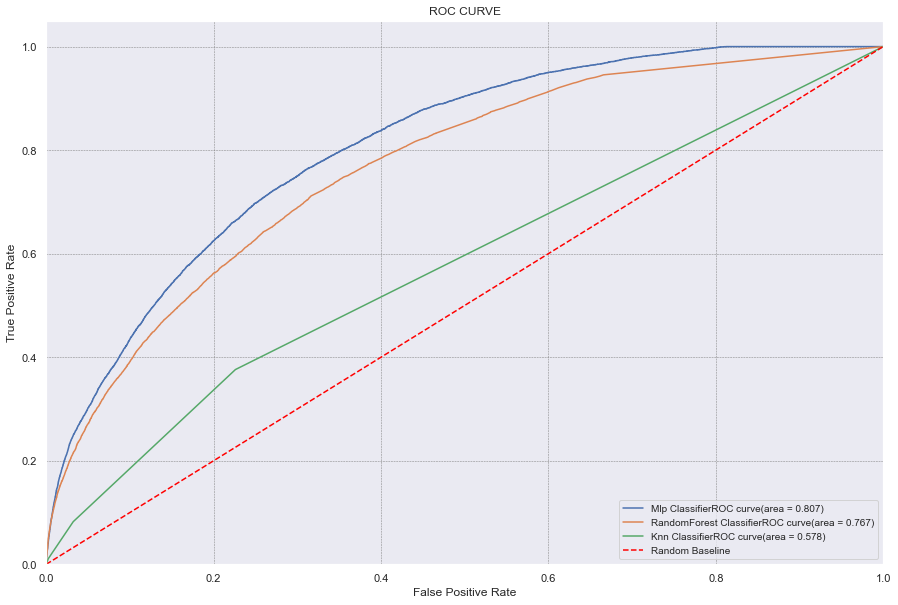
Entry :<a href="https://www.comet.com/api/image/download?imageId=f7e6759448e9429e95a69aaec2f414e8&experimentKey=206aeb1f89fb4ceca57b7000cf679611">ROC Curve</a>

 
Goal rate vs probability percentile

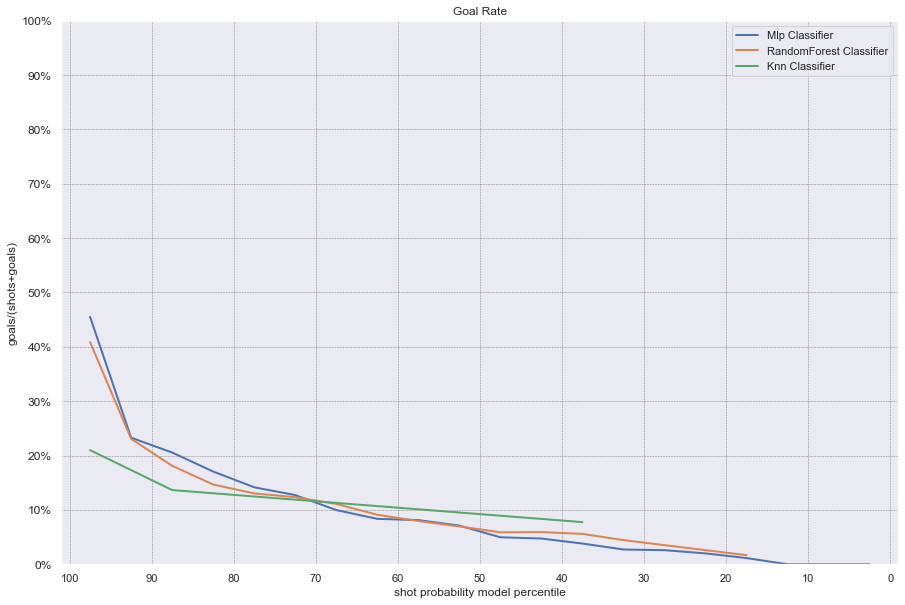
Entry :<a href="https://www.comet.com/api/image/download?imageId=992449d3b0dd48aa8bdc89d8d1161fb3&experimentKey=ca369bf926c34d959337975ef7fd027e">Goal Rate</a>

 
Cumulative proportion of goals vs probability percentile

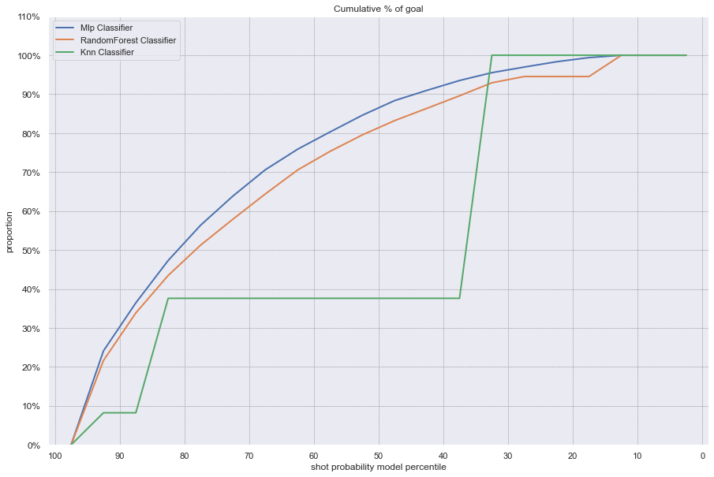
Entry : <a href="https://www.comet.com/api/image/download?imageId=d1efbc387b4f4143a4d93d138fcdc8bb&experimentKey=ca369bf926c34d959337975ef7fd027e">Cumulative % of goals</a>

 
Reliability curve

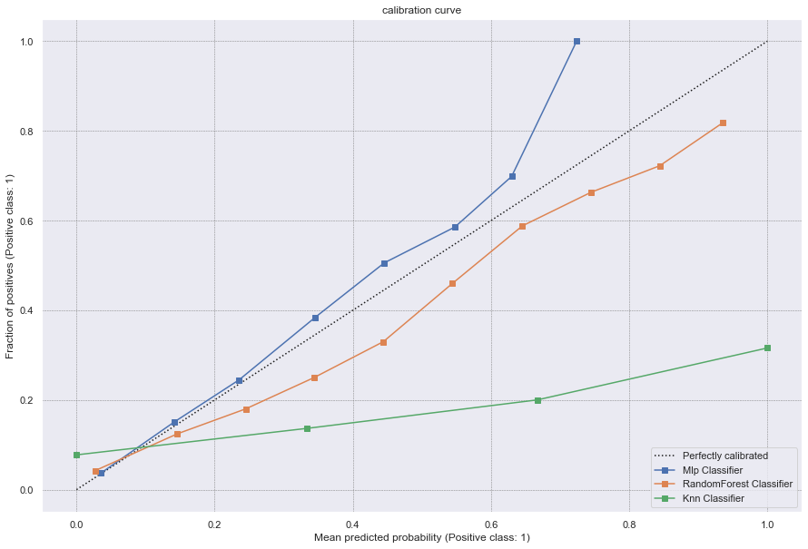
Entry : <a href="https://www.comet.com/api/image/download?imageId=3ce38af970094181bef69d3cc9763b91&experimentKey=ca369bf926c34d959337975ef7fd027e">Calibration plot</a>

 
precision-recall curve is used for evaluating the performance of binary classification algorithms with classes which are 
heavily imbalanced, like the case in our dataset where amount of no_goal is larger than goal.A high area under the curve represents both high recall and high precision, where high precision relates to a low false positive rate, and high recall relates to a low false negative rate.High scores for both show that the classifier is returning accurate results (high precision), as well as returning a majority of all positive results (high recall).
Hence, as MLP classifier has the highest area under the graph it is the better classfier.
Similary AUC(area under Roc Curve) provides an aggregate measure of performance across all possible classification thresholds.
As MLP has the highest area under the roc curve it performs better.
 
From performance Visualization plots and accuracy on validation set it can be concluded that <b>MLP classifier</b>
performs better than other models. Hence, it is the best shot model in all classifiers.

 
## Question 7. Evaluate on test set
 
Experiment Entry : <a href="https://www.comet.com/ift6758-22-team2/nhl-analytics/1f7eaab900a340f6ad0521f1259b5929?experiment-tab=chart&showOutliers=true&smoothing=0&transformY=smoothing&xAxis=step">Q7_Evaluate_on_test_set</a> 
 
<b>7.a) Test on 2019/20 regular season dataset</b> 
 

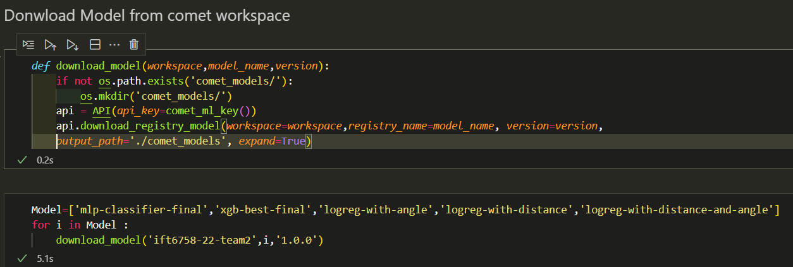

 
<b>Model Evaluation performance Visualization</b>  
Precision-Recall Curve

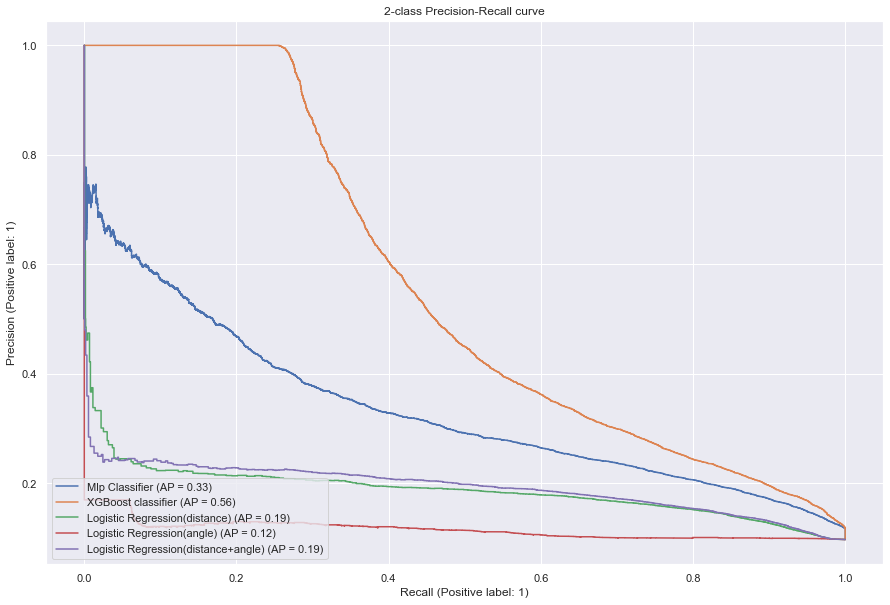
Entry :<a href="https://www.comet.com/api/image/download?imageId=b323ad4c66614085b35b7da4671bd0ef&experimentKey=1f7eaab900a340f6ad0521f1259b5929">Precision-Recall Curve</a>

 
ROC Curve

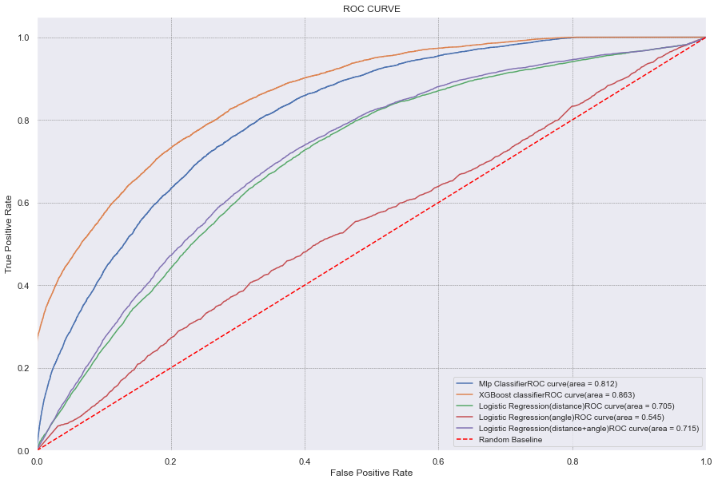
Entry :<a href="https://www.comet.com/api/image/download?imageId=f56e37f63ec049af998b6efa2119ffe3&experimentKey=1f7eaab900a340f6ad0521f1259b5929">ROC Curve</a>

 
Goal rate vs probability percentile

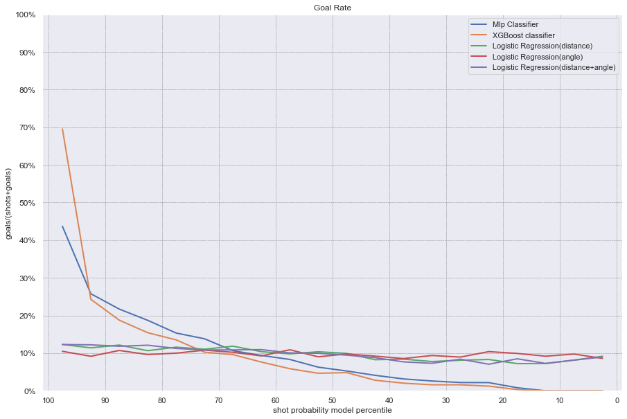
Entry :<a href="https://www.comet.com/api/image/download?imageId=fcc45ceaea2c4519a051661aedc1346c&experimentKey=1f7eaab900a340f6ad0521f1259b5929">Goal Rate</a>

 
Cumulative proportion of goals vs probability percentile

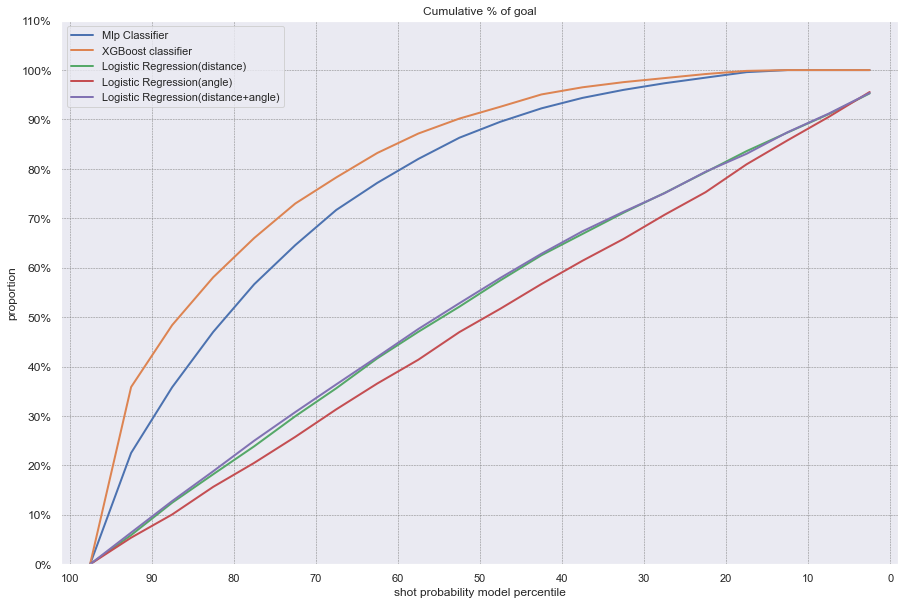
Entry : <a href="https://www.comet.com/api/image/download?imageId=65b30c667a7244d29557729c468f15ac&experimentKey=1f7eaab900a340f6ad0521f1259b5929">Cumulative % of goals</a>

 
Reliability curve

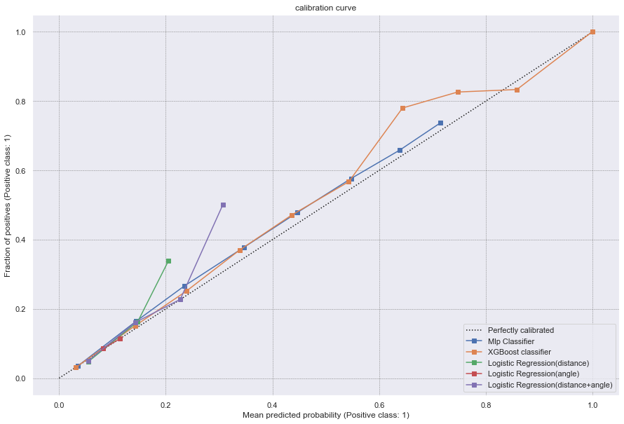
Entry : <a href="https://www.comet.com/api/image/download?imageId=947f41fd10304aae94bd5dcde8ab5e84&experimentKey=1f7eaab900a340f6ad0521f1259b5929">Calibration plot</a>

 
Best Classifier on 2019-2020 Regular Season
 

<table>
  <tr>
    <th>Model</th>
    <th>Accuracy</th>
  </tr>
    <tr>
    <td>XGB</td>
    <td>0.928702</td>
  </tr>
  <tr>
    <td>MLP</td>
    <td>0.905500 </td>
  </tr>
    <tr>
    <td>Logistic Regression(distance)</td>
    <td>0.903028</td>
  </tr>
    <tr>
    <td>Logistic Regression(angle)</td>
    <td>0.903028</td>
  </tr>
    <tr>
    <td>Logistic Regression(distance+angle)</td>
    <td>0.903028</td>
  </tr>
</table>
 
It can be observed that model accuracy for all classifier reduced when 
evaluated for test set. The percentage decrease in performance for mlp
was the greatest among other models. Overall the models gave satisfactory results
similar to those on validation set. XGboost performed the best among all classifiers with 
accuracy of 0.928.

 

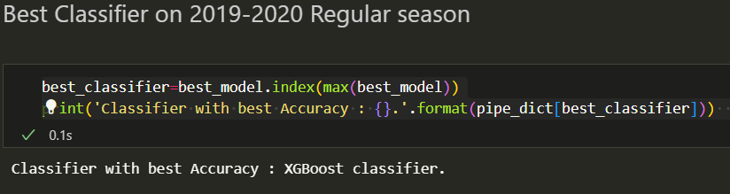

  
<b>7.B) Test on 2019/20 Playoff season dataset</b> 
 

<b>Model Evaluation performance Visualization</b>  
Precision-Recall Curve

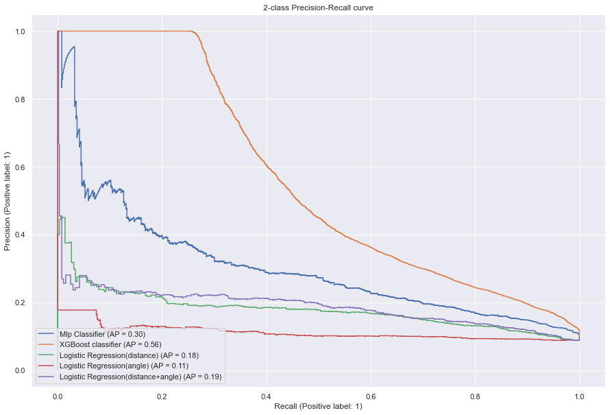
Entry :<a href="https://www.comet.com/api/image/download?imageId=6b49eadc9d4143469a9d6f991dd5f1fa&experimentKey=1f7eaab900a340f6ad0521f1259b5929">Precision-Recall Curve</a>

 
ROC Curve

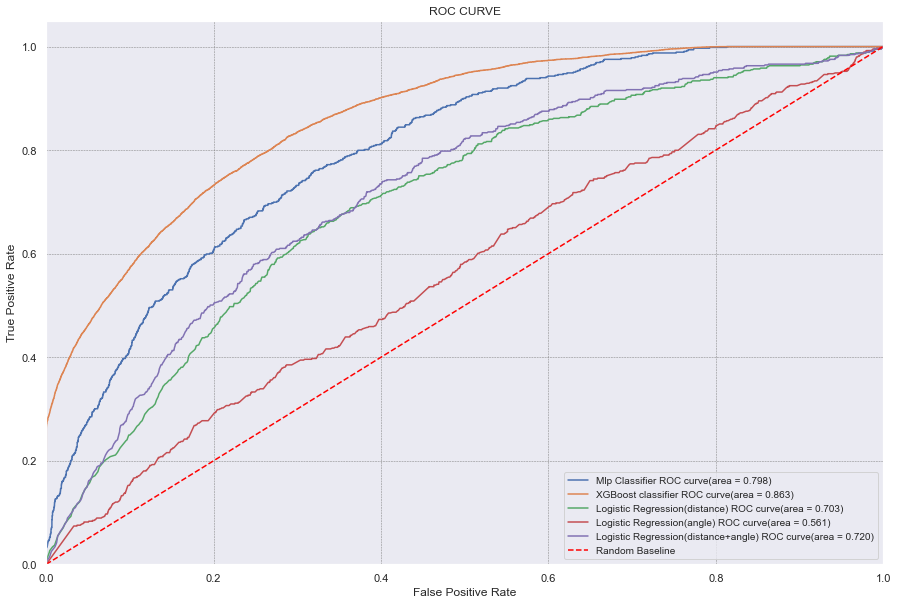
Entry :<a href="https://www.comet.com/api/image/download?imageId=42658cfe5897489790476968aaaa4d32&experimentKey=1f7eaab900a340f6ad0521f1259b5929">ROC Curve</a>

 
Goal rate vs probability percentile

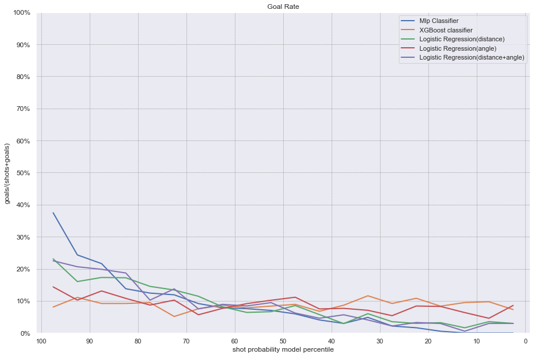
Entry :<a href="https://www.comet.com/api/image/download?imageId=7f1615abf69849d9ba1036c726eabc7b&experimentKey=1f7eaab900a340f6ad0521f1259b5929">Goal Rate</a>

 
Cumulative proportion of goals vs probability percentile

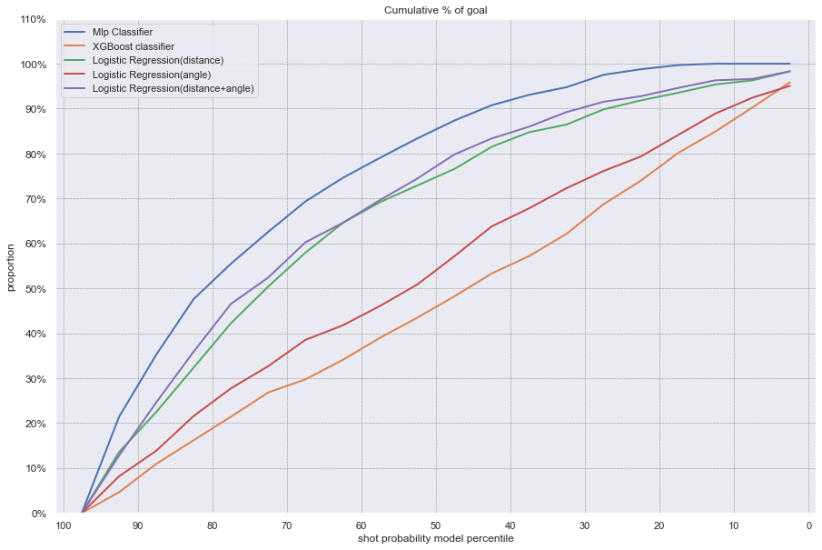
Entry : <a href="https://www.comet.com/api/image/download?imageId=0226ded34e9845d880cbaaafbcef82bb&experimentKey=1f7eaab900a340f6ad0521f1259b5929">Cumulative % of goals</a>

 
Reliability curve

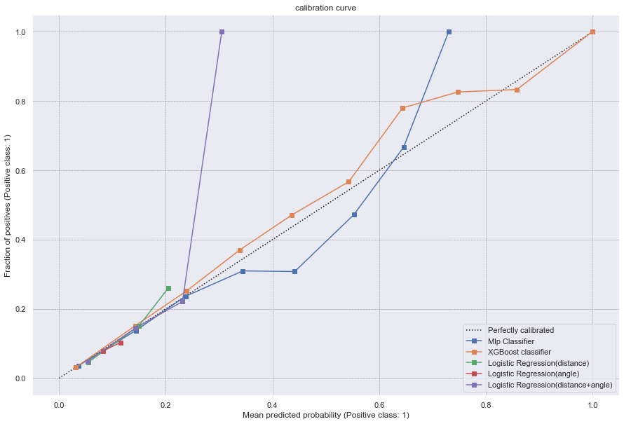
Entry : <a href="https://www.comet.com/api/image/download?imageId=915667b6a64a4d46acbbf5466bc436e3&experimentKey=1f7eaab900a340f6ad0521f1259b5929">Calibration plot</a>

  
Best Classifier on 2019-2020 Playoff Season
 
<table>
  <tr>
    <th>Model</th>
    <th>Accuracy</th>
  </tr>
    <tr>
    <td>XGB</td>
    <td>0.928702</td>
  </tr>
  <tr>
    <td>MLP</td>
    <td>0.913954</td>
  </tr>
    <tr>
    <td>Logistic Regression(distance)</td>
    <td>0.912333</td>
  </tr>
    <tr>
    <td>Logistic Regression(angle)</td>
    <td>0.912333</td>
  </tr>
    <tr>
    <td>Logistic Regression(distance+angle)</td>
    <td>0.912333</td>
  </tr>
</table>
 
MLP, and all logistic models gave better accuracy than their corresponding validation accuracy,
it could only mean that dataset used for testing is slightly different than the one used for training the models.
As we used regular season data for training but used playoff season for testing the models.
Xgboost has the highest area under the graph for both ROC and Precision-Recall curve and also gave 
the best accuracy among all classifiers.
 

 
 

